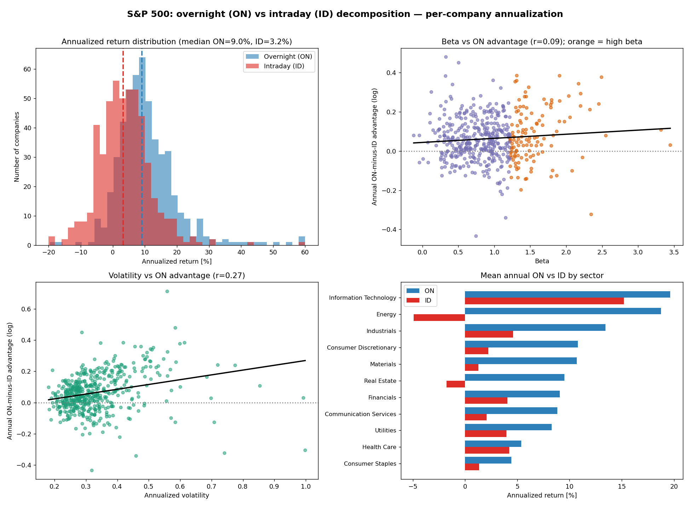

# S&P 500 — Overnight vs Intraday

Decomposes S&P 500 stock returns into an **overnight (ON)** and **intraday (ID)** component, with rankings, metadata (sector, market cap, volatility, beta) and statistical tests between groups.

The project replicates a well-known market anomaly: historically, most of a stock's return is earned **outside trading hours** (between the close and the next open), not during the session.

## Definitions

For each session `t`:

```
ON_t = Open_t / Close_{t-1} - 1     # overnight (the overnight gap)
ID_t = Close_t / Open_t   - 1       # intraday (the trading session)
```

Cumulative returns are computed as the geometric product of `(1 + r)` (and also as the sum of log returns, since `log(1+ON) + log(1+ID) = log(1 + close-to-close)`).

## Features

- Fetches the **current S&P 500 constituents** from Wikipedia (with a CSV-mirror fallback) including GICS sector.
- Downloads daily **adjusted OHLC** from Yahoo Finance (`yfinance`).
- Computes cumulative and **annualized** ON and ID per company.
- Builds 3 rankings: `ON >> ID`, `ID >> ON`, `ON ~ ID`.
- Adds sector, market cap, volatility (ON/ID/close-to-close) and beta.
- Statistical tests (Welch t-test + Mann-Whitney): do tech / small caps / high beta have a different overnight profile.
- Generates a summary chart (`--charts`).

## Installation

```bash
python -m venv .venv
source .venv/bin/activate        # Windows: .venv\Scripts\activate
pip install -r requirements.txt
```

> Recommended Python **3.11 / 3.12**. On the newest versions (3.13/3.14) some libraries may not yet ship prebuilt wheels.

## Usage

```bash
# full run with charts, results written to out/
python sp500_overnight_intraday.py --start 2015-01-01 --charts --outdir out

# common window (apples-to-apples) and top 25 in rankings
python sp500_overnight_intraday.py --start 2015-01-01 --common-start 2016-01-01 --topx 25 --charts --outdir out

# quick test without metadata, on 10 companies
python sp500_overnight_intraday.py --limit 10 --skip-meta --outdir out
```

| Flag | Description |
|---|---|
| `--start` | OHLC history start (default 2015-01-01) |
| `--end` | history end (default: today) |
| `--common-start` | common window — truncate all series to this date |
| `--topx` | ranking size (default 25) |
| `--skip-meta` | skip downloading market cap / beta |
| `--charts` | save the PNG dashboard |
| `--limit` | limit the number of companies (debug) |
| `--outdir` | output directory |

## Outputs

- `sp500_on_id_all.csv` / `.parquet` — full per-company metrics
- `rank_ON_dominates.csv`, `rank_ID_dominates.csv`, `rank_similar.csv`
- `group_tests.csv` — statistical test results
- `sp500_overnight_dashboard.png` — charts



## Methodology and caveats

- Uses **adjusted** prices (`auto_adjust=True`), so splits/dividends do not artificially distort overnight gaps.
- **Survivorship bias**: we use *today's* index membership, so results are upward-biased (companies that dropped out of the S&P 500 are missing).
- Results are **gross** — no transaction costs, taxes or slippage; executing at the exact open/close prices is not achievable in practice.
- Companies with different history lengths: for comparisons use `--common-start` or the annualized columns.

## License

Released under the **MIT** license — you may freely use, modify and distribute it, keeping the copyright notice. See the [LICENSE](LICENSE) file.

## Disclaimer

Educational/analytical project. **This is not investment advice.** Data comes from Yahoo Finance and is subject to their terms of use — it is not redistributed in this repository.
